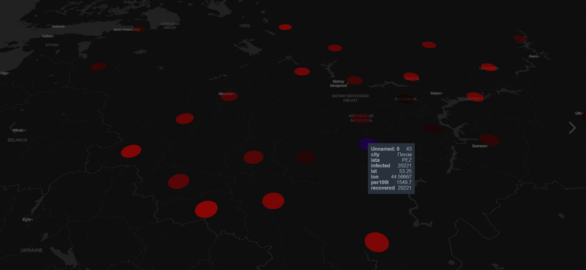

# Программа для поиска 
Я написала программу, которая помогает в путешествиях по России в период пандемии

---

# Шаг первый. Сбор информации

[Скрипт этого шага](src/scrapping.ipynb)

Сначала нам нужно достать всю информацию о городах России

* Информацию о распространении ковида в городах
* Название аэропортов в формате IATA

Информацию о регионах мы можем найти с [сайта](https://www.bbc.com/russian/features-51979104)

Информацию о аэропортах с [сайта](https://aviateka.su/kody-aeroportov-iata-icao-rf)

Сложнее найти информацию о том - в каком регионе, какой город "центральный". В России существует несколько понятий центральных городов областей: Административный центр, Областной центр и Столица. Находить мы их будем тем, что будем на странице в википедии каждого из регионов будем находить его центральный город. Это был довольно сложный веб-скраппинг, потому что влияет очень много факторов.

Все данные будем между собой объединять с помощью pandas и его продвинутых функций. В самом [скрипте скраппинга](src/scrapping.ipynb) нет никаких полезных выводов, но вот он сам в качестве доказательства того, что я не сама находила информацию руками.

Какая есть информация о каждом городе:

* Сколько в нём заболевших ковидом
* Сколько в нём выздоровевших от ковида
* Сколько в нём умерших от ковида
* Аэропорт в формате IATA
* Сколько в нём человек болеет ковидом на 100к населения.
* Широта
* Долгота

Все данные приходят в XML формате и для поиска используются beautifulsoup и строковые алгоритмы. Поиск был сложным, ведь у нас явно нет базы данных с городами и IATA кодами городов, и нужно было объединять между собой несколько скреппингов для дальнейшего скреппинга. А ведь он получился очень даже ничего!

---

# Шаг 2. Отрисовка карты и информация на карте о городах, в соответствии с ситуацией с ковидом

[Скрипт этого шага](src/maps_find_tickets.ipynb)

Для отрисовки я использовала аналог geopandas - PyDeck. В него можно передавать pandas DataFrame'ы, но в нём есть больше функционала.
Будем на городах рисовать красные круги, и чем краснее круг - тем хуже в нём ситуация (тем больше в нём на 100к населения больных ковидом).

Github Не отображает PyDeck, но он интерактивный. Чтобы попробовать интерактивность карты, даже не нужен питон. Нужен только ваш браузер. Скачайте [страничку](https://raw.githubusercontent.com/Lmes21607/russia_traveler/main/src/map.html)

Инструкция по скачиванию и открыванию:

* Перейти на страничка
* Нажать правую кнопку мыши
* "Сохранить как"
* Сохраняете файл
* Открываете его как обычный файл
* Если у вас спрашивают какой программой открыть - выберите ваш основной браузер

Пример того, какую картку можно получить:

Ну правда же клёвая визуализация, да ещё и с геоданными, да?

В своём браузере вы можете сами покрутить карту. При наведении на красные кружки отображается информация о том - какой это город. Напомню, что они не одного цвета - чем темнее, тем лучше ситуация с ковидом, чем краснее - тем хуже (оценка по кол-во заболевших на 100к населения).

Дальше у нас есть Jupyter-Notebook виджеты. Их не видно на github, но локально они выглядят так:

Там можно выбрать из списка всех доступных городов с аэропортами и дату отправления. После выбора двух городо, выбора даты и нажатия кнопки - нам покажется граф перемещений на самолёте из одного города в другой. Это сделано для того, что могут быть пересадки и в этот момент можно погулять в других городах. Пример того, как может получиться:

Граф строится с помощью библиотеки networkx.

Тут видно, что можно полететь из Перми в Киров через Москву или через Санкт-Петербург. Соответственно пользователь уже может задуматься о том, как ему лететь.

Поиск осуществляется с помощью API Яндекс.Расписания, которое мы не проходили на семинарах, я сама! Чтобы попробовать у себя это - вы можете скачать ipynb и взять свой api ключ [отсюда](https://developer.tech.yandex.ru/)

Парсить Яндекс.Расписание надо с помощью JSON.

Также рассчитывается расстояние между этими городами по [математической формуле](https://ru.wikipedia.org/wiki/%D0%9E%D1%80%D1%82%D0%BE%D0%B4%D1%80%D0%BE%D0%BC%D0%B8%D1%8F)

---

# Шаг 3. Анализ данных для выбора города

[Скрипт для этого шага](src/script.r)

Мы, естественно, не хотим лететь в самый больной город, поэтому проанализируем с помощью R, ggplot2 и geom данные для дальнейшего нашего выбора.

Сначала построим график типа barplot:

А теперь, предположим, мы не хотим лететь в города, где на 100к населения приходится хотя бы 2к больных. Тогда просто очертим наш график и посмотрим на города, у которых значение ниже очерченного прямоугольника:

---

# Итог

Фуууух. Ну получилось немало.
